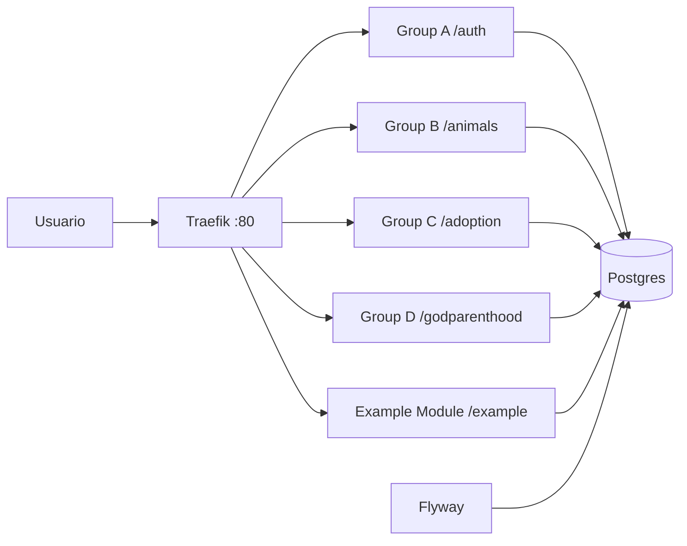
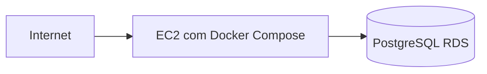

# PIACA

## Visao Geral

O projeto esta organizado em tres camadas principais:

- `piaca-frontend/`: aplicacao web.
- `piaca-backend/`: modulos de backend por dominio, migrations e servicos HTTP.
- `piaca-infra/`: infraestrutura AWS com Terraform para rede, EC2 e RDS.

No ambiente local, a orquestracao e feita pelo arquivo `docker-compose.local.yml`. Ele sobe os servicos compartilhados e os modulos de backend em containers isolados, todos conectados na mesma rede Docker.

## Arquitetura da Infra

### Execucao local

O ambiente local usa os seguintes componentes:

- `traefik`: reverse proxy de entrada na porta `80`.
- `postgres`: banco PostgreSQL local na porta `5432`.
- `flyway`: aplicacao automatica das migrations do banco.
- modulos de backend: um container por grupo, exposto via rotas do Traefik.

Fluxo local:



### Infraestrutura em nuvem

Os arquivos em `piaca-infra/` descrevem uma base simples na AWS:

- `network/`: cria a chave SSH e os security groups para EC2 e RDS.
- `ec2/`: cria uma instancia EC2, instala Docker e Docker Compose e sobe a aplicacao.
- `rds/`: cria uma instancia PostgreSQL gerenciada no RDS.

Desenho logico da nuvem:



## Estrutura dos Modulos

Cada grupo possui um modulo dedicado dentro de `piaca-backend/`:

- `group-a-core-auth/`: autenticacao e identidade.
- `group-b-pet-management/`: gestao de animais.
- `group-c-adoption-ai/`: recomendacoes e inteligencia para adocao.
- `group-d-godparenthood/`: padrinhamento e acompanhamento.
- `example-module/`: modulo de referencia para desenvolvimento e testes.

Cada modulo deve seguir a mesma ideia base:

- possuir seu proprio `Dockerfile`.
- expor uma porta HTTP interna do container.
- consumir o banco pelas variaveis `DB_HOST`, `DB_PORT`, `DB_NAME`, `DB_USER` e `DB_PASSWORD`.
- ser registrado no Traefik por labels e por um prefixo de rota.

## Como Cada Grupo Pode Usar Seu Modulo

Cada grupo trabalha de forma isolada no proprio diretorio dentro de `piaca-backend/`, mas compartilha a mesma infraestrutura local:

1. implementar o codigo do modulo no seu diretorio.
2. garantir que o `Dockerfile` do modulo instala as dependencias e inicia a aplicacao.
3. descomentar o servico correspondente em `docker-compose.local.yml`.
4. manter as variaveis de banco apontando para o servico `postgres` do compose local.
5. definir a rota de acesso no Traefik pelas labels do servico.

Rotas previstas no compose local:

- grupo A: `/auth`
- grupo B: `/animals`
- grupo C: `/adoption`
- grupo D: `/godparenthood`
- exemplo: `/example`

Se um grupo criar uma nova dependencia, alterar o `Dockerfile` ou modificar o codigo da aplicacao, precisa reconstruir a imagem para que o container receba a atualizacao.

## Banco de Dados e Migrations

As migrations ficam em `piaca-backend/migrations/flyway/`.

- `V1__create_test_table.sql`: cria a tabela de teste.
- `V2__insert_test_data.sql`: insere dados iniciais na tabela de teste.

O container `flyway` executa automaticamente essas migrations ao subir no ambiente local.

## Como Rodar Localmente

### 1. Pre-requisitos

Instale:

- Docker Desktop
- Docker Compose

### 2. Subir o ambiente local

Na raiz do repositorio:

```bash
docker compose -f docker-compose.local.yml up -d --build
```

Esse comando:

- constroi as imagens locais.
- sobe Traefik, Postgres, Flyway e os modulos habilitados.
- aplica as migrations do banco.

### 3. Acessar os servicos

Com o ambiente no ar, os endpoints ficam acessiveis pela porta `80` do Traefik:

- `http://localhost/example`
- `http://localhost/auth`
- `http://localhost/animals`
- `http://localhost/adoption`
- `http://localhost/godparenthood`

Os endpoints acima so responderao se o servico correspondente estiver habilitado no `docker-compose.local.yml`.

## Como Aplicar Novas Atualizacoes

Sempre que houver alteracao de codigo, dependencia ou configuracao de build, faca o rebuild do servico ou do ambiente inteiro. Sem isso, o container continua executando a imagem antiga.

### Rebuild de todo o ambiente

```bash
docker compose -f docker-compose.local.yml up -d --build
```

### Rebuild de um modulo especifico

Exemplo para o modulo de referencia:

```bash
docker compose -f docker-compose.local.yml up -d --build example-module
```

Exemplo para um modulo de grupo:

```bash
docker compose -f docker-compose.local.yml up -d --build piaca-core-auth
```

### Rodar novamente apenas as migrations

```bash
docker compose -f docker-compose.local.yml up flyway
```

## Comandos Uteis

### Ver containers em execucao

```bash
docker compose -f docker-compose.local.yml ps
```

### Ver logs de um servico

```bash
docker compose -f docker-compose.local.yml logs -f example-module
```

### Consultar o banco localmente

```bash
docker exec -it piaca-postgres psql -U piaca_user -d piaca_db
```

### Parar o ambiente

```bash
docker compose -f docker-compose.local.yml down
```

## Observacoes Importantes

- o arquivo `docker-compose.local.yml` e o ponto principal para desenvolvimento local.
- o arquivo `docker-compose.yml` representa uma configuracao mais generica, usando variaveis externas de ambiente para banco.
- os servicos dos grupos A, B, C e D estao comentados no compose local atual; cada grupo deve descomentar o seu servico quando for trabalhar nele.
- qualquer mudanca em `package.json`, bibliotecas instaladas, `Dockerfile` ou configuracao do container exige `build` novamente.
